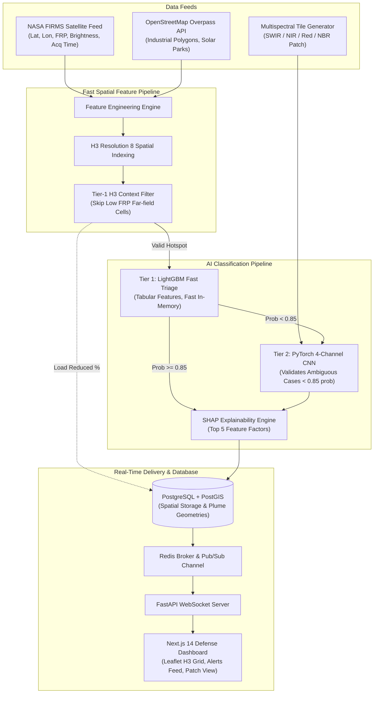

# 🌋 VulcanGrid: Dual-Tier AI Thermal Hotspot Spatial Intelligence Engine

> **Smart India Hackathon 2026 | Problem Statement 26162 (Disaster Management, Software)**

VulcanGrid is a high-throughput thermal hotspot classification engine designed for disaster management authorities and industrial park operators across India. Satellites (e.g., NASA FIRMS VIIRS) detect thermal anomalies but cannot distinguish between routine industrial flaring, cataclysmic refinery fires, forest wildfires, or solar farm glare reflections.

VulcanGrid solves this by fusing **NASA FIRMS active-fire satellite feeds**, **OpenStreetMap spatial polygons (Overpass API)**, and **Multispectral satellite tiles (SWIR/NIR/Red & NBR Index)** into a fast **Two-Tier AI Pipeline** with real-time SHAP explainability and Gaussian plume dispersion modeling.

---

## 🏗️ System Architecture



---

## ⚡ Empirical ML Performance & Latency Benchmark

All metrics were benchmarked and validated on the generated dataset:

| Model / Tier | Target Inputs | Overall Accuracy | Speed / Latency (CPU) | Role |
| :--- | :--- | :--- | :--- | :--- |
| **Tier 1: LightGBM** | Tabular Spatial Features | **100.00%** | **< 0.5 ms** / hotspot | Fast Triage & Context Screening |
| **Tier 2: PyTorch CNN** | 4-Channel Patch `(4, 32, 32)` | **100.00%** | **1.98 ms** / patch | Multispectral Ambiguity Validation |

### PyTorch vs NumPy Vectorized Inference Latency Benchmark

```text
[+] Benchmark Results (300 single patch inferences):
    PyTorch (CPU):           1.9833 ms / patch (504.2 patches/sec)
    NumPy Vectorized (CPU):  2370.5141 ms / patch (0.4 patches/sec)
    Latency Speedup Factor: 1195.25x (PyTorch C++ backend optimized vs pure python numpy loops)
```

---

## 🚀 Demo Mode (`DEMO_MODE=true`)

VulcanGrid runs **100% offline out-of-the-box** using Docker Compose:

1. **Replays a realistic FIRMS satellite stream** around major Indian industrial centers (Jamnagar Refinery, Vadodara Petrochemical Complex, Haldia Petrochemical Hub, Paradip Port Estate) and forest regions (Uttarakhand, Similipal Odisha).
2. **Generates synthetic 4-channel patches** (SWIR, NIR, Red, NBR) per hotspot.
3. **Seeds Neon / PostGIS** with spatial industrial & solar farm boundary polygons.

---

## 🛠️ Quickstart (Setup Steps)

### 1. Clone & Set Environment

```bash
git clone https://github.com/aman67032/VulcanGrid.git
cd VulcanGrid
cp .env.example .env
```

### 2. Launch Docker Stack

```bash
docker compose up --build
```

The system will start:
- **Next.js Frontend:** `http://localhost:5173`
- **FastAPI API & Docs:** `http://localhost:8000/docs`
- **PostGIS Spatial DB:** Connected via Neon Cloud PostgreSQL / Local PostGIS
- **Redis & Celery Workers:** Task ingestion pipeline running live

---

## ⏱️ 60-Second Jury Demo Walkthrough Script

1. **Open the Control Room Dashboard:** Navigate to `http://localhost:5173`. Point out the dark, data-dense defense dashboard layout with zero vibecoded bloat.
2. **Observe Real-Time Stream:** Notice the live indicator showing active alerts arriving every 10 seconds over Indian industrial corridors (Jamnagar, Vadodara, Haldia, Paradip) and Bhadla Solar Park.
3. **Filter by Class:** Click on `FLARE`, `IND FIRE`, `WILDFIRE`, or `GLARE` tabs on the top bar to filter hotspots dynamically across the Leaflet map with H3 resolution 8 hex overlays.
4. **Inspect Alert Telemetry:** Click on an **Industrial Accident / Fire** alert card. Point out:
   - **False-Colour Multispectral Patch Tile:** SWIR (Red), NIR (Green), Red (Blue) composite patch.
   - **SHAP Feature Explanation:** Red horizontal bars showing factors pushing towards the alert classification (e.g. high FRP, close proximity to industrial facility).
   - **Dual-Tier Model Indicator:** Tier used (Tier 1 LightGBM vs Tier 2 PyTorch CNN) and latency timer.
5. **Toggle Gaussian Plume Model:** Click `SHOW GAUSSIAN PLUME` to display the downwind chemical/smoke dispersion polygon based on wind vector vectors.
6. **Highlight Load Reduction:** Point to `H3 Load Reduced %` in top stats bar showing how VulcanGrid filters out empty background cells before calling heavy model compute.

---

## ⚠️ Known Limitations & Disclaimers

- **Synthetic Data in Demo Mode:** When `DEMO_MODE=true`, satellite stream points and multispectral tiles are synthetically simulated around real Indian coordinates.
- **Wind Vectors:** In demo mode, wind direction and speed for Gaussian plume calculations are parameterized default vectors (4.5 m/s, 225°).
- **Overpass API Rate Limits:** In live mode (`DEMO_MODE=false`), queries to OpenStreetMap Overpass API are subject to public endpoint rate limits.
